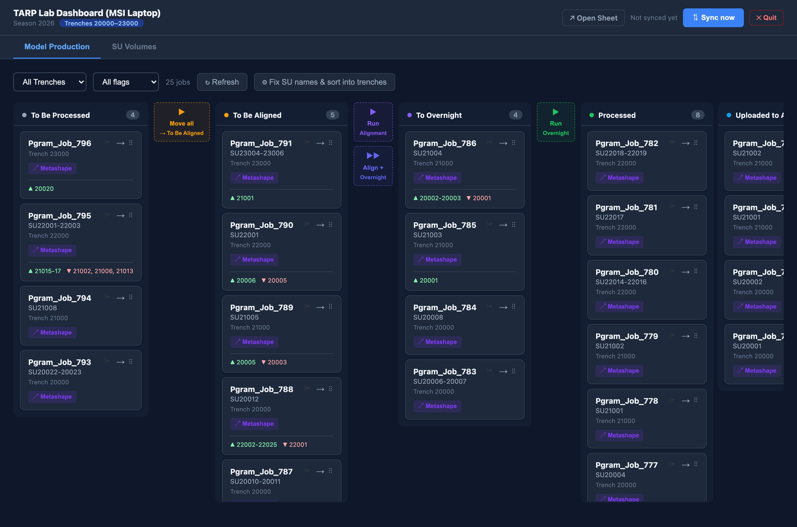
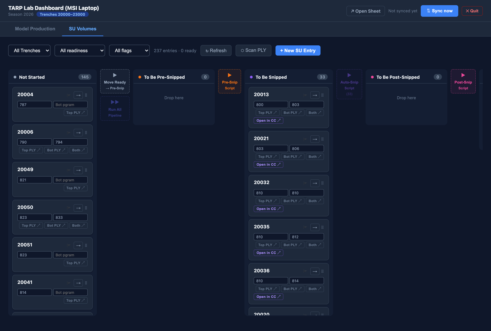
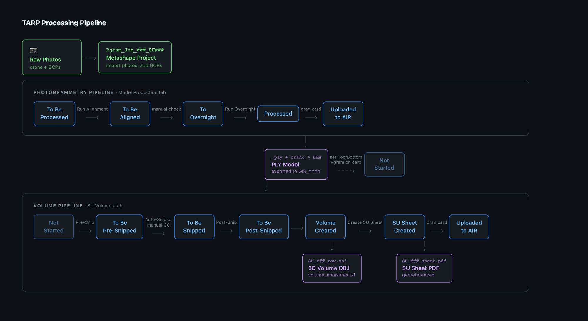

# TARP Lab Dashboard

Localhost kanban dashboard for the **[Tharros Archaeological Research Project (TARP)](https://air.ht.lu.se/s/tharros/page/home)**. Tracks photogrammetry jobs through the full processing pipeline and SU volume production. Syncs with Google Sheets so the Field and Lab machines share a single source of truth. Dark-mode UI, built for Windows (MSI lab machine) and Mac (dev).

See also: [`tarp-field`](https://github.com/infinityp913/tarp-field) — light-mode Field website for archaeologists on the site.

---

## Dashboard

**Model Production** — kanban board for `Pgram_Job_###` folders. Moving a card physically moves the folder on disk. Column buttons launch Metashape alignment and overnight scripts per job.



**SU Volumes** — tracks each Stratigraphic Unit through the CloudComPy snip pipeline to final volume OBJ and SU sheet. Buttons on each card run the pre-snip, auto-snip, and post-snip scripts directly from the browser.



---

## Full Pipeline



---

## Photogrammetry Pipeline

Each Pgram job moves left-to-right through five physical stage folders on disk. Moving a card on the dashboard moves the actual folder — no separate file management step.

```
To Be Processed → To Be Aligned → To Overnight → Processed → Uploaded to AIR
```

### Full pipeline: photos to PLY

1. **Import photos** into Metashape — create a new `Pgram_Job_###_SU####` folder in `To Be Processed / Trench NNNNN /`.
2. **Add GCPs** — load the season GCP CSV in Metashape and mark targets.
3. **Run Alignment** — click the **Align →** button on the card. The dashboard calls the headless alignment script (`TARP 2026 Alignment Script - Headless.py`) via Metashape's `-r` flag and moves the card to `To Be Aligned`.

   > The alignment script refuses to run until `gcp_csv` is set in `config.yaml` — a guard against accidentally aligning without ground control.

4. **Manual alignment check** — open the project in Metashape and verify the sparse cloud. Fix any misaligned cameras before the overnight run.
5. **Move to overnight** — drag the card to `To Overnight` (the dashboard shows a confirmation dialog: _"Did the alignment script run successfully?"_).
6. **Run Overnight** — click the **Overnight →** button. The script runs dense reconstruction, builds the mesh, and exports PLY + orthophoto + DEM to `overnight_output_assets_root`. Card moves to `Processed`.

   > The overnight button is per-column, not per-card — it runs all jobs in `To Overnight` sequentially. Typically triggered at end of day so machines run overnight unattended.

7. **Upload to AIR** — once PLY is confirmed in the output folder, drag the card to `Uploaded to AIR`. The Google Sheets row is updated automatically.

### Running only alignment (no overnight)

Click **Align →** on any card in `To Be Processed`. The script runs for that single job only. The button is disabled if `alignment` or `gcp_csv` is not set in `config.yaml`.

### Running only overnight

Click **Overnight →** at the top of the `To Overnight` column. All jobs in that column run sequentially. Progress is streamed live to the dashboard while the script runs.

---

## Volume Model Production

SU volume production starts once a Pgram job reaches `Processed` and PLY files are available in the output folder. Each SU moves through its own pipeline on the **SU Volumes** tab.

```
Not Started → To Be Pre-Snipped → To Be Snipped → To Be Post-Snipped → Volume Created → SU Sheet Created → Uploaded to AIR
```

### Linked repositories

The volume pipeline runs scripts from two external repos — configure their paths in `config.yaml`:

- **[cloudcomparescript](https://github.com/infinityp913/cloudcomparescript)** — pre-snip, auto-snip, and post-snip scripts using [CloudComPy](https://github.com/CloudCompare/CloudComPy). Computes distances between top/bottom PLY pairs, runs Poisson surface reconstruction, and outputs volume OBJ meshes.
- **[AutomateSuSheetCreation](https://github.com/infinityp913/AutomateSuSheetCreation)** — QGIS-based script that reads the volume OBJ and writes a georeferenced SU sheet PDF ready for upload to the AIR repository.

### Step 1: Pre-Snip

Set the **Top Pgram** and **Bottom Pgram** fields on the SU card (the two Pgram job numbers whose PLY files bound this SU). Then click **Pre-Snip** on the card.

The pre-snip script:
- Loads the top and bottom PLY meshes
- Samples both to point clouds
- Computes bidirectional C2C distances
- Saves distance-coloured BIN files in `Data/Pgram_Job_###/`

The card advances to `To Be Snipped` automatically.

### Step 2: Snipping

At this stage a human crops the point clouds in CloudCompare to isolate just the SU area and remove noise.

**Auto-Snip (iPhone LiDAR — recommended):** If the field team painted the SU with yellow paint and captured a LiDAR scan with the iPhone, click **Auto-Snip**. The script reads a `.usdz` annotation file, projects the LiDAR scan onto the top-down PLY render, and uses a rolling-ball algorithm to extract the SU boundary polygon. No CloudCompare interaction required.

**Manual Snip:** Click **Open in CC** to open the pre-snip BINs in CloudCompare. Crop the top and bottom clouds to the SU boundary, then save both together as `<su>.bin` in `Data/SU<su>/`. Once saved, drag the card to `To Be Post-Snipped`.

> The card cannot be dragged from `To Be Snipped` to `To Be Post-Snipped` without confirmation — the dialog prompts you to verify that both cropped clouds have been saved before post-snip runs.

### Step 3: Post-Snip

Click **Post-Snip** on the card. The post-snip script:
- Loads the cropped top and bottom clouds from `Data/SU<su>/`
- Merges them and runs Poisson surface reconstruction
- Calculates 3D volume (cubic centimetres) and 2.5D projected volume
- Writes final OBJ meshes to `Volumetrics_YYYY/Trench NNNNN/SU<su>/`
- Appends results to `volume_measures.txt`

The card advances to `Volume Created`.

### Step 4: SU Sheet

Click **Create SU Sheet** on the card. The script uses QGIS to:
- Load the volume OBJ in the season's GIS project
- Compute the SU footprint polygon
- Export a georeferenced PDF SU sheet

The card advances to `SU Sheet Created`, then you upload the sheet to the AIR repository and drag the card to `Uploaded to AIR`.

---

## Setup

Full first-time instructions are in [`LAB_HOWTO.md`](LAB_HOWTO.md). Quick reference:

### 1. `config.yaml`

```yaml
base_path: "C:\\Users\\Photogrammetry"   # Windows stage-folder root
dev_base_path: "/Users/you/tarp-test"     # Mac dev path (used when not on Windows)

season_year: 2026
current_year_trenches:
  min: 20000
  max: 23000

scripts:
  alignment: "C:\\...\\TARP 2026 Alignment Script - Headless.py"
  overnight:  "C:\\...\\TARP 2026 Overnight Script - Headless.py"
  gcp_csv:    "C:\\...\\GCPs 2026 ... EPSG32632.csv"
  overnight_output_assets_root: "C:\\Users\\Photogrammetry\\GIS_2026"

  pre_snip:         "C:\\...\\cloudcomparescript\\pre_snip_script.py"
  auto_snip:        "C:\\...\\cloudcomparescript\\auto_snip_script.py"
  post_snip:        "C:\\...\\cloudcomparescript\\post_snip_script.py"
  create_su_sheet:  "C:\\...\\AutomateSuSheetCreation\\generate_su_sheets.py"
  volume_script_dir: "C:\\...\\cloudcomparescript"
  cloudcompy_python: "C:\\...\\CloudComPy\\venv312\\Scripts\\python.exe"
  cloudcompy_root:   "C:\\...\\CloudComPy\\CloudComPy312"
  create_su_sheet_dir: "C:\\...\\AutomateSuSheetCreation"
  qgis_launcher:    "C:\\Program Files\\QGIS 3.40.8\\bin\\python-qgis-ltr.bat"

gsheets_spreadsheet_id: ""   # from the spreadsheet URL
```

### 2. Google Sheets

1. Enable **Google Sheets API** in Google Cloud Console.
2. Create an **OAuth 2.0 Desktop App** credential, download `credentials.json`, place it in the repo root.
3. Run the auth flow once: `python3 -c "from backend.services.gsheets import run_auth_flow; run_auth_flow()"`

### 3. Run

```bash
# First time — install deps and build the frontend bundle
pip install -r requirements.txt
cd frontend && npm install && npm run build && cd ..

# Start (opens browser at http://127.0.0.1:8000)
python3 -m backend.main
```

On Windows, `setup.bat` runs the pip install and frontend build. `start.bat` starts the server.

---

## Development

```bash
# Backend with hot-reload
python3 -m backend.main --dev

# Frontend dev server (proxies /api to :8000)
cd frontend && npm run dev

# Tests
python3 -m pytest tests/ -v
```

> **Windows PowerShell:** use `python` instead of `python3`. Use `;` instead of `&&`.

---

## Stage folder structure

```
C:\Users\Photogrammetry\
├── To Be Processed\
│   └── Trench 20000\
│       └── Pgram_Job_793_SU20022-20023\
├── To Be Aligned\
├── To Overnight\
├── Processed\
└── Uploaded to AIR\
```

Job folders must match `Pgram_Job_###` or `Pgram_Job_###_anything`. The dashboard shows a warning banner for misnamed folders and offers a one-click fix via the **Fix SU names** button.

Only folders inside a `Trench NNNNN` subfolder whose number falls in `current_year_trenches` are shown. Out-of-season trenches and loose folders at the stage root are ignored.

---

## Google Sheets schema

### Pgram Jobs (columns A–J)
`Pgram Number` · `Trench` · `SUs Open` · `SUs Closed` · `Photos—No Alignment` · `Alignment+Manual Check` · `PLY Created` · `Uploaded to AIR` · `Notes` · `Last Updated (CET)`

### SU Tracking (columns A–J)
`SU ID` · `Top Pgram` · `Bottom Pgram` · `Volume Stage` · `Volume Created` · `SU Sheet Created` · `Uploaded to AIR` · `Notes` · `Last Updated (CET)` · `Snip Method`

Syncs use staging tabs (`Pgram Jobs_Staging`, `SU Tracking_Staging`) with a single `batchUpdate copyPaste` to the live tabs, minimising the window where live data is empty. A random 0–3 s jitter reduces Lab + Field sync collisions.

---

## Related repositories

| Repo | Purpose |
|---|---|
| [`tarp-field`](https://github.com/infinityp913/tarp-field) | Light-mode Field website for archaeologists on site |
| [`cloudcomparescript`](https://github.com/infinityp913/cloudcomparescript) | CloudComPy scripts for pre-snip, auto-snip, post-snip, and volume calculation |
| [`AutomateSuSheetCreation`](https://github.com/infinityp913/AutomateSuSheetCreation) | QGIS script for generating georeferenced SU sheet PDFs |
